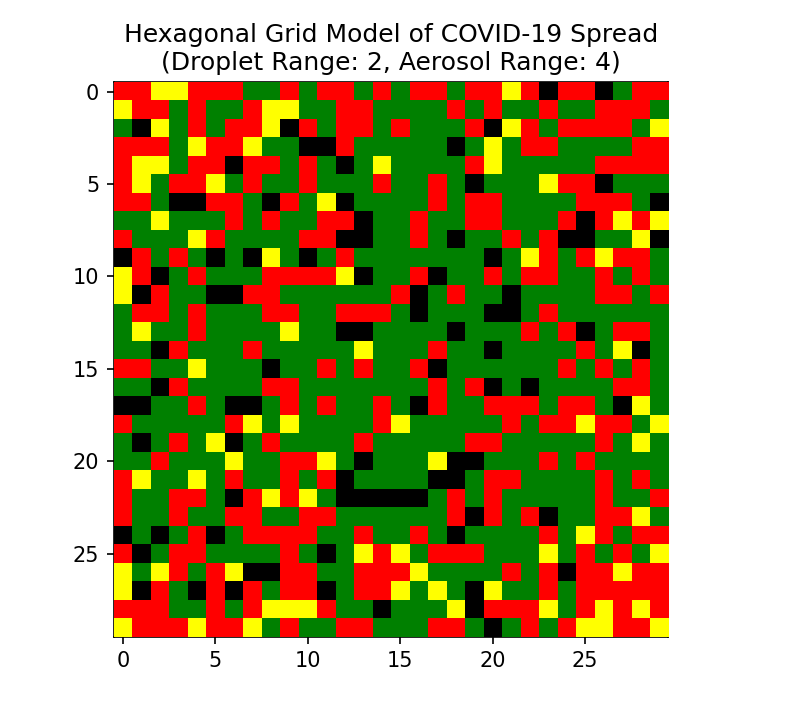
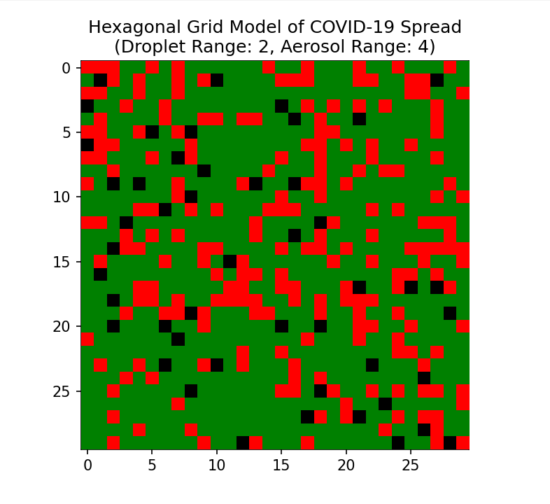
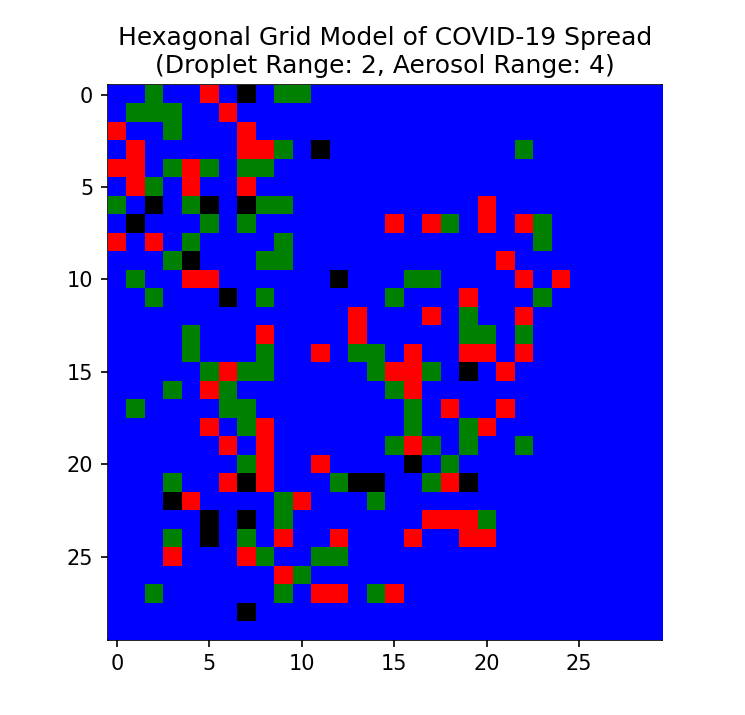

# COVID-19 Spread Simulation on a Hexagonal Grid

A Python-based simulation that models the spread of COVID-19 through **contact, droplet, and aerosol transmission mechanisms**, incorporating **virus mutation** and **vaccination strategies** on a **hexagonal spatial grid**.

---

## 🎯 Project Overview

This project aims to explore how different transmission mechanisms and public-health interventions shape epidemic outcomes in a spatially structured population.  
Unlike traditional compartmental models (e.g., SIR), this simulation explicitly models **individual-level interactions** on a grid, capturing stochastic effects and spatial heterogeneity.

Key research questions:
- How do transmission modes (contact, droplet, aerosol) influence epidemic dynamics?
- What role do mutations play in sustaining infection waves?
- How do timing and coverage of vaccination affect outbreak control?

---

## 🧮 Model Design

### 🧩 Simulation Framework
- The population is represented on a **hexagonal grid**, where each cell corresponds to one individual.  
- Each individual can be in one of the following states:
  - **S**usceptible  
  - **I**nfected  
  - **R**ecovered (immune)  
  - optionally **V**accinated or **M**utated strain carrier

### 🦠 Transmission Mechanisms
1. **Contact transmission** — nearest neighbors (radius = 1)  
2. **Droplet transmission** — moderate range with decaying probability  
3. **Aerosol transmission** — low probability but long range  

Each mechanism is simulated probabilistically at every time step.

### 🔄 Stochastic Dynamics
- Random infection events are drawn using `numpy.random`.  
- Monte Carlo–style sampling determines which cells transition between states.  
- The model allows for multiple viral strains with varying transmissibility and immunity escape.  
- Vaccination reduces infection probability based on coverage and efficacy.

---

## 📊 Results Summary

Key insights from simulation runs:

| Scenario | Transmission Types | Mutation | Vaccination | Observed Outcome |
|-----------|--------------------|-----------|--------------|------------------|
| Baseline | Contact only | No | No | Slow, localized outbreak |
| Mixed transmission | Contact + Droplet | No | No | Faster spread, larger epidemic size |
| Mutation enabled | All | Yes | No | Recurrent infection waves |
| Vaccination (70 %) | All | Yes | Yes | Flattened curve, reduced peak infection |

**Main Findings**
- Droplet and aerosol mechanisms dramatically increase \( R_{\text{eff}} \).  
- Mutations with even slightly higher transmissibility quickly dominate.  
- Early, high-coverage vaccination drastically reduces total infections.

---

## 🧠 Discussion

This model highlights the importance of **spatial structure** and **stochasticity** in epidemic dynamics.  
Even small probabilistic differences in transmission range or timing can produce qualitatively different outcomes.  
The framework bridges theoretical epidemiology and computational simulation, offering a foundation for future studies on adaptive interventions or policy simulations.

---

## 🧩 Technologies Used
`Python` · `NumPy` · `Matplotlib` · `random` · `seaborn` (optional for visualization)

---

## 🚀 Future Extensions
- Add **real mobility patterns** or **contact networks** instead of fixed grid positions.  
- Include **waning immunity** and **booster vaccination**.  
- Parallelize simulation for larger populations.

---

## 📷 Visualization Examples

|--------|---------------|
| spread |  |
| spread+mutation |  |
| spread+mutation+vaccination |  |

---
